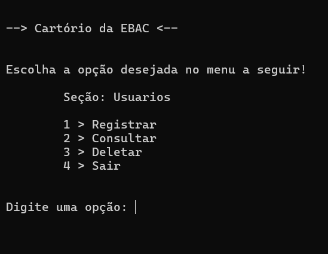
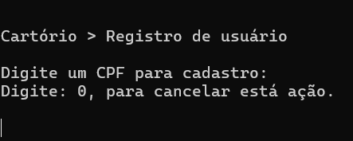
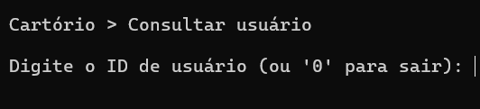
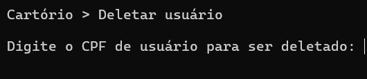

# CARTÓRIO (Projeto Menu)!
Projeto nascido e criado na fundação EBAC, dentro do curso: TI do Zero ao Pro, com a finalidade de criar um menu simulando algumas funções básicas relacionadas a linguagem: C.

# Sistema de Cadastro e Consulta de Usuários

*Este projeto é um sistema simples para gerenciar usuários, permitindo o cadastro, consulta, edição e exclusão de dados de usuários. Foi desenvolvido como parte de um estudo em programação, utilizando **PHP/C** para o back-end e registros simples para o armazenamento em banco de dados.*

## Funcionalidades
- Cadastro de novos usuários.
- Consulta de informações dos usuários cadastrados.
- Edição de dados do usuário.
- Exclusão de usuários.

## Armazenamento
- `Registrados.txt`: Responsavel por caputurar as infirmações registradas e enfileirar, dando ao CLiente um pequeno bando de dados
- `Recentes.txt`: Responsável por trazer as informações dos registrados, criando uma lista de consulta e impedindo que a função "Deletar" apague mais do que o necessário.

## Tecnologias Utilizadas
- **C/PHP** _(para o back-end)_.

## Público-alvo:

- Desenvolvedores do sistema.
- Administradores do sistema.
- Equipe de suporte técnico.

## Ilustração:

\- `Menu inicial`: 🪟

- `Função de Registro` ✒️

- `Função de Consulta` 📖

- `Função de Delete` 🗑️


## Evolutivas 💻💾
- Implementação de persistência de dados em banco de dados.
- Melhorias na interface do usuário, como um sistema gráfico (**GUI**).
- Funcionalidades adicionais, como atualização de dados de usuários ou exportação de registros.
- Tratativa de erros e Monitoria de usuários.
- Backup de Dados e armazenamento em nuvem.

# Contato
**📩 Email: juiceluqi@gmail.com**

## Instalação
1. Clone o repositório:
   ```bash
   git clone https://github.com/juiceluqi/Catorio_EBAC---2025.git

